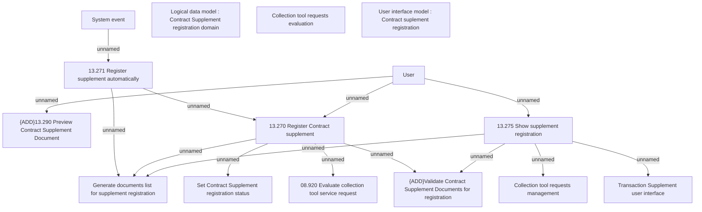

# Contract supplement registration

```mermaid
graph TD
    Transaction_Supplement_user_interface["Transaction Supplement user interface"]
    ADD_13_290_Preview_Contract_Supplement_Document["{ADD}13.290 Preview Contract Supplement Document"]
    ADD_Validate_Contract_Supplement_Documents_for_registration["{ADD}Validate Contract Supplement Documents for registration"]
    System_event["System event"]
    n_13_271_Register_supplement_automatically["13.271 Register supplement automatically"]
    Collection_tool_requests_management["Collection tool requests management"]
    Logical_data_model_Contract_Supplement_registration_domain["Logical data model : Contract Supplement registration domain"]
    Collection_tool_requests_evaluation["Collection tool requests evaluation"]
    n_08_920_Evaluate_collection_tool_service_request["08.920 Evaluate collection tool service request"]
    User_interface_model_Contract_suplement_registration["User interface model : Contract suplement registration"]
    Set_Contract_Supplement_registration_status["Set Contract Supplement registration status"]
    Generate_documents_list_for_supplement_registration["Generate documents list for supplement registration"]
    n_13_275_Show_supplement_registration["13.275 Show supplement registration"]
    n_13_270_Register_Contract_supplement["13.270 Register Contract supplement"]
    User["User"]
    n_13_271_Register_supplement_automatically -->|unnamed| n_13_270_Register_Contract_supplement
    n_13_271_Register_supplement_automatically -->|unnamed| Generate_documents_list_for_supplement_registration
    n_13_270_Register_Contract_supplement -->|unnamed| Generate_documents_list_for_supplement_registration
    n_13_275_Show_supplement_registration -->|unnamed| Generate_documents_list_for_supplement_registration
    n_13_270_Register_Contract_supplement -->|unnamed| Set_Contract_Supplement_registration_status
    n_13_270_Register_Contract_supplement -->|unnamed| n_08_920_Evaluate_collection_tool_service_request
    n_13_275_Show_supplement_registration -->|unnamed| Collection_tool_requests_management
    n_13_270_Register_Contract_supplement -->|unnamed| ADD_Validate_Contract_Supplement_Documents_for_registration
    n_13_275_Show_supplement_registration -->|unnamed| ADD_Validate_Contract_Supplement_Documents_for_registration
    n_13_275_Show_supplement_registration -->|unnamed| Transaction_Supplement_user_interface
    System_event -->|unnamed| n_13_271_Register_supplement_automatically
    User -->|unnamed| n_13_270_Register_Contract_supplement
    User -->|unnamed| ADD_13_290_Preview_Contract_Supplement_Document
    User -->|unnamed| n_13_275_Show_supplement_registration
```
