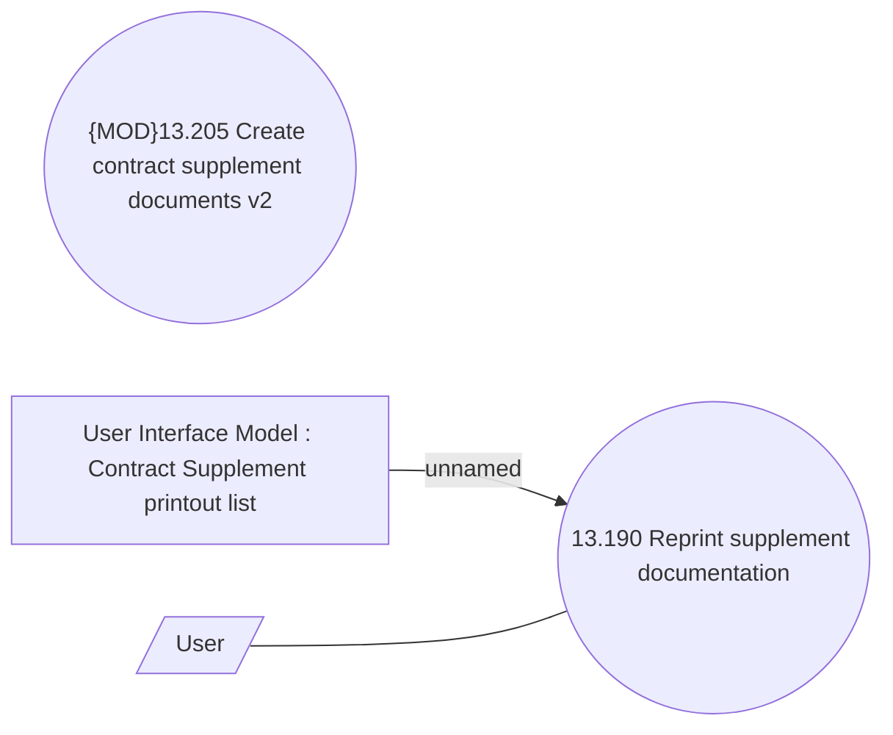

# Supplement document management

- **Diagram Type**: Use Case
- **Package**: HomerSelect/BSL/Analysis Model/Contract Supplements/COMMON for Supplements/Contract Supplement operations/Contract Supplement document management/UseCase Model
- **Diagram ID**: 164457
- **Elements**: 4
- **Connectors**: 2

