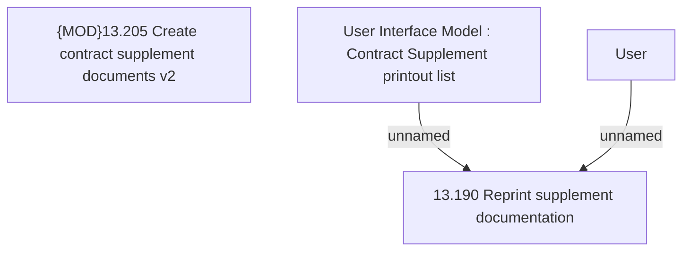

# Supplement document management

```mermaid
graph TD
    MOD_13_205_Create_contract_supplement_documents_v2["{MOD}13.205 Create contract supplement documents v2"]
    User_Interface_Model_Contract_Supplement_printout_list["User Interface Model : Contract Supplement printout list"]
    n_13_190_Reprint_supplement_documentation["13.190 Reprint supplement documentation"]
    User["User"]
    User_Interface_Model_Contract_Supplement_printout_list -->|unnamed| n_13_190_Reprint_supplement_documentation
    User -->|unnamed| n_13_190_Reprint_supplement_documentation
```
