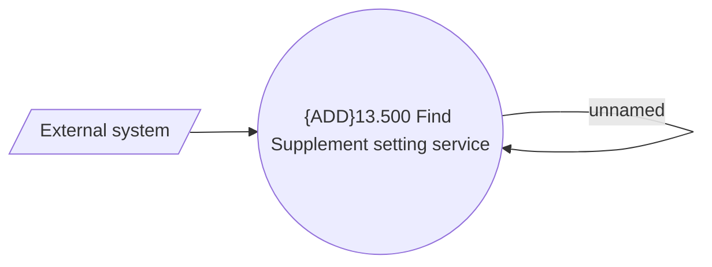

# Supplement - Getting Supplement setting

- **Diagram Type**: Use Case
- **Package**: HomerSelect/BSL/Analysis Model/Contract Supplements/COMMON for Supplements/Supplement definition/Use Case Model
- **Diagram ID**: 151357
- **Elements**: 3
- **Connectors**: 2

