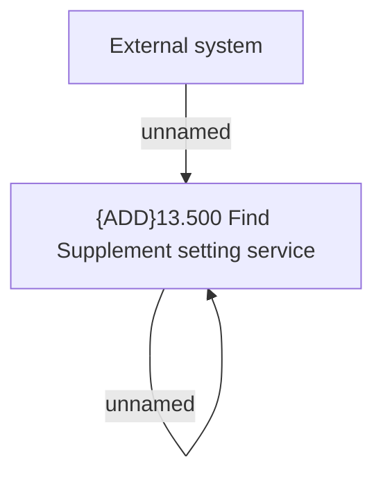

# Supplement - Getting Supplement setting

```mermaid
graph TD
    ADD_13_500_Find_Supplement_setting_service["{ADD}13.500 Find Supplement setting service"]
    External_system["External system"]
    ADD_13_500_Find_Supplement_setting_service["{ADD}13.500 Find Supplement setting service"]
    ADD_13_500_Find_Supplement_setting_service -->|unnamed| ADD_13_500_Find_Supplement_setting_service
    External_system -->|unnamed| ADD_13_500_Find_Supplement_setting_service
```
