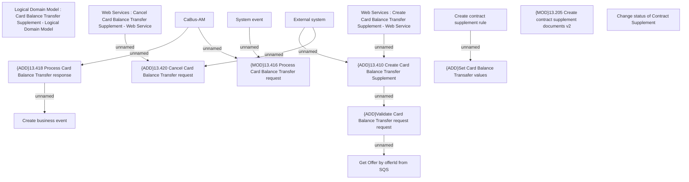

# Card Balance Transfer request processing - Use Case Model

```mermaid
graph TD
    Logical_Domain_Model_Card_Balance_Transfer_Supplement_Logica["Logical Domain Model : Card Balance Transfer Supplement - Logical Domain Model"]
    ADD_13_418_Process_Card_Balance_Transfer_response["{ADD}13.418 Process Card Balance Transfer response"]
    Web_Services_Cancel_Card_Balance_Transfer_Supplement_Web_Ser["Web Services : Cancel Card Balance Transfer Supplement - Web Service"]
    ADD_13_420_Cancel_Card_Balance_Transfer_request["{ADD}13.420 Cancel Card Balance Transfer request"]
    CaBus_AM["CaBus-AM"]
    Create_business_event["Create business event"]
    MOD_13_416_Process_Card_Balance_Transfer_request["{MOD}13.416 Process Card Balance Transfer request"]
    System_event["System event"]
    Get_Offer_by_offerId_from_SQS["Get Offer by offerId from SQS"]
    ADD_Validate_Card_Balance_Transfer_request_request["{ADD}Validate Card Balance Transfer request request"]
    Web_Services_Create_Card_Balance_Transfer_Supplement_Web_Ser["Web Services : Create Card Balance Transfer Supplement - Web Service"]
    External_system["External system"]
    ADD_13_410_Create_Card_Balance_Transfer_Supplement["{ADD}13.410 Create Card Balance Transfer Supplement"]
    Create_contract_supplement_rule["Create contract supplement rule"]
    MOD_13_205_Create_contract_supplement_documents_v2["{MOD}13.205 Create contract supplement documents v2"]
    Change_status_of_Contract_Supplement["Change status of Contract Supplement"]
    ADD_Set_Card_Balance_Transafer_values["{ADD}Set Card Balance Transafer values"]
    Web_Services_Create_Card_Balance_Transfer_Supplement_Web_Ser -->|unnamed| ADD_13_410_Create_Card_Balance_Transfer_Supplement
    Web_Services_Cancel_Card_Balance_Transfer_Supplement_Web_Ser -->|unnamed| ADD_13_420_Cancel_Card_Balance_Transfer_request
    ADD_13_418_Process_Card_Balance_Transfer_response -->|unnamed| Create_business_event
    ADD_13_410_Create_Card_Balance_Transfer_Supplement -->|unnamed| ADD_Validate_Card_Balance_Transfer_request_request
    ADD_Validate_Card_Balance_Transfer_request_request -->|unnamed| Get_Offer_by_offerId_from_SQS
    External_system -->|unnamed| ADD_13_410_Create_Card_Balance_Transfer_Supplement
    External_system -->|unnamed| ADD_13_420_Cancel_Card_Balance_Transfer_request
    System_event -->|unnamed| MOD_13_416_Process_Card_Balance_Transfer_request
    CaBus_AM -->|unnamed| ADD_13_418_Process_Card_Balance_Transfer_response
    CaBus_AM -->|unnamed| MOD_13_416_Process_Card_Balance_Transfer_request
    Create_contract_supplement_rule -->|unnamed| ADD_Set_Card_Balance_Transafer_values
```
