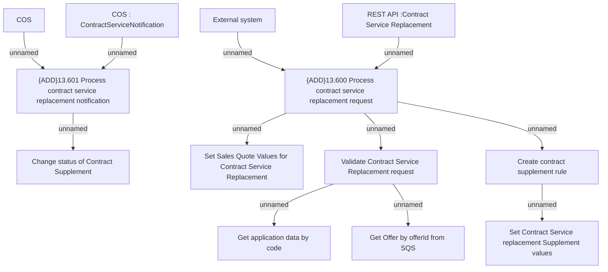

# Contract service replacement request processing

```mermaid
graph TD
    COS_ContractServiceNotification["COS : ContractServiceNotification"]
    Change_status_of_Contract_Supplement["Change status of Contract Supplement"]
    COS["COS"]
    ADD_13_601_Process_contract_service_replacement_notification["{ADD}13.601 Process contract service replacement notification"]
    Get_Offer_by_offerId_from_SQS["Get Offer by offerId from SQS"]
    Get_application_data_by_code["Get application data by code"]
    Set_Sales_Quote_Values_for_Contract_Service_Replacement["Set Sales Quote Values for Contract Service Replacement"]
    Set_Contract_Service_replacement_Supplement_values["Set Contract Service replacement Supplement values "]
    Create_contract_supplement_rule["Create contract supplement rule"]
    Validate_Contract_Service_Replacement_request["Validate Contract Service Replacement request"]
    REST_API_Contract_Service_Replacement["REST API :Contract Service Replacement "]
    ADD_13_600_Process_contract_service_replacement_request["{ADD}13.600 Process contract service replacement request"]
    External_system["External system"]
    External_system -->|unnamed| ADD_13_600_Process_contract_service_replacement_request
    REST_API_Contract_Service_Replacement -->|unnamed| ADD_13_600_Process_contract_service_replacement_request
    ADD_13_600_Process_contract_service_replacement_request -->|unnamed| Validate_Contract_Service_Replacement_request
    ADD_13_600_Process_contract_service_replacement_request -->|unnamed| Create_contract_supplement_rule
    Create_contract_supplement_rule -->|unnamed| Set_Contract_Service_replacement_Supplement_values
    ADD_13_600_Process_contract_service_replacement_request -->|unnamed| Set_Sales_Quote_Values_for_Contract_Service_Replacement
    Validate_Contract_Service_Replacement_request -->|unnamed| Get_application_data_by_code
    Validate_Contract_Service_Replacement_request -->|unnamed| Get_Offer_by_offerId_from_SQS
    COS -->|unnamed| ADD_13_601_Process_contract_service_replacement_notification
    COS_ContractServiceNotification -->|unnamed| ADD_13_601_Process_contract_service_replacement_notification
    ADD_13_601_Process_contract_service_replacement_notification -->|unnamed| Change_status_of_Contract_Supplement
```
