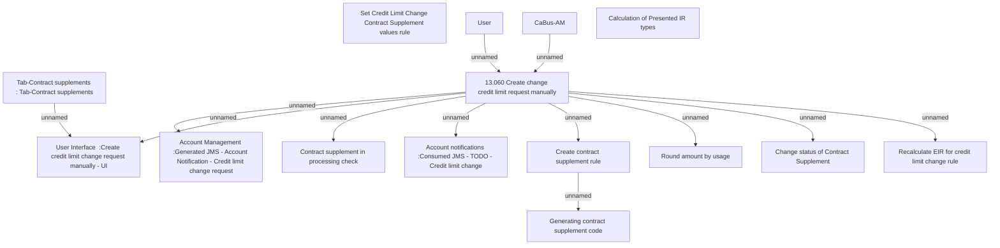

# Change credit limit manually

```mermaid
graph TD
    Recalculate_EIR_for_credit_limit_change_rule["Recalculate EIR for credit limit change rule"]
    Set_Credit_Limit_Change_Contract_Supplement_values_rule["Set Credit Limit Change Contract Supplement values rule"]
    Tab_Contract_supplements_Tab_Contract_supplements["Tab-Contract supplements : Tab-Contract supplements"]
    Change_status_of_Contract_Supplement["Change status of Contract Supplement"]
    Round_amount_by_usage["Round amount by usage"]
    CaBus_AM["CaBus-AM"]
    Create_contract_supplement_rule["Create contract supplement rule"]
    Generating_contract_supplement_code["Generating contract supplement code"]
    Account_notifications_Consumed_JMS_TODO_Credit_limit_change["Account notifications :Consumed JMS - TODO - Credit limit change"]
    Contract_supplement_in_processing_check["Contract supplement in processing check"]
    User_Interface_Create_credit_limit_change_request_manually_U["User Interface  :Create credit limit change request manually - UI"]
    Account_Management_Generated_JMS_Account_Notification_Credit["Account Management :Generated JMS - Account Notification - Credit limit change request"]
    User["User"]
    n_13_060_Create_change_credit_limit_request_manually["13.060 Create change credit limit request manually"]
    Calculation_of_Presented_IR_types["Calculation of Presented IR types"]
    n_13_060_Create_change_credit_limit_request_manually -->|unnamed| Account_Management_Generated_JMS_Account_Notification_Credit
    Tab_Contract_supplements_Tab_Contract_supplements -->|unnamed| User_Interface_Create_credit_limit_change_request_manually_U
    n_13_060_Create_change_credit_limit_request_manually -->|unnamed| User_Interface_Create_credit_limit_change_request_manually_U
    n_13_060_Create_change_credit_limit_request_manually -->|unnamed| Contract_supplement_in_processing_check
    n_13_060_Create_change_credit_limit_request_manually -->|unnamed| Account_notifications_Consumed_JMS_TODO_Credit_limit_change
    n_13_060_Create_change_credit_limit_request_manually -->|unnamed| Create_contract_supplement_rule
    n_13_060_Create_change_credit_limit_request_manually -->|unnamed| Round_amount_by_usage
    n_13_060_Create_change_credit_limit_request_manually -->|unnamed| Change_status_of_Contract_Supplement
    n_13_060_Create_change_credit_limit_request_manually -->|unnamed| Recalculate_EIR_for_credit_limit_change_rule
    User -->|unnamed| n_13_060_Create_change_credit_limit_request_manually
    CaBus_AM -->|unnamed| n_13_060_Create_change_credit_limit_request_manually
    Create_contract_supplement_rule -->|unnamed| Generating_contract_supplement_code
```
