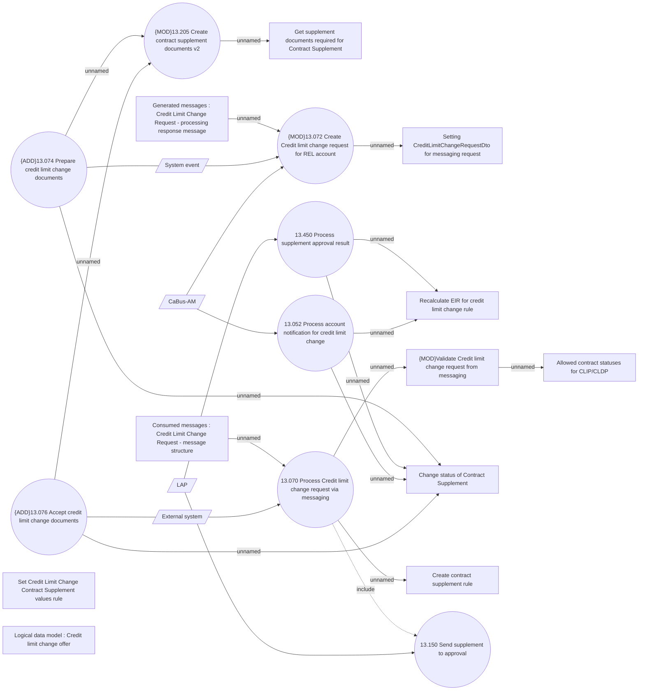

# Credit Limit Change via messaging - Use Case model

- **Diagram Type**: Use Case
- **Package**: HomerSelect/BSL/Analysis Model/Contract Supplements/Credit limit change support/UseCase model
- **Diagram ID**: 164253
- **Elements**: 23
- **Connectors**: 24

