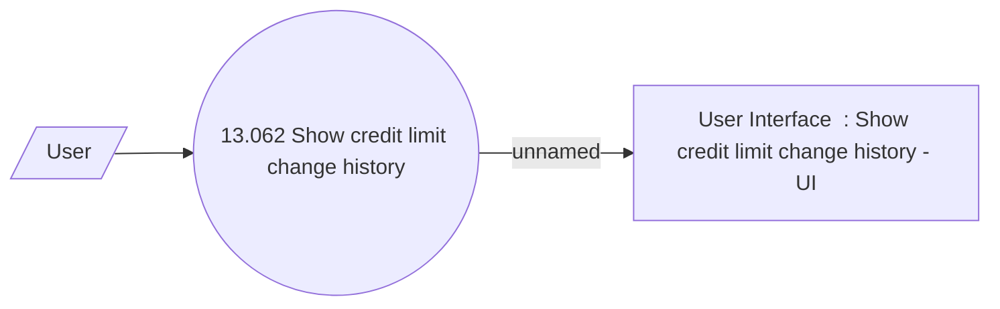

# Show credit limit change history

- **Diagram Type**: Use Case
- **Package**: HomerSelect/BSL/Analysis Model/Contract Supplements/Credit limit change support/UseCase model
- **Diagram ID**: 164252
- **Elements**: 3
- **Connectors**: 2

