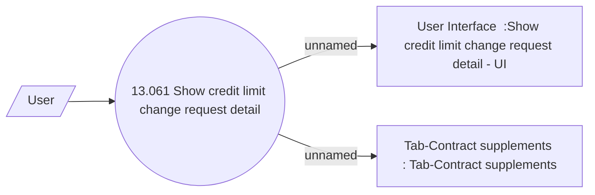

# Show credit limit change request

- **Diagram Type**: Use Case
- **Package**: HomerSelect/BSL/Analysis Model/Contract Supplements/Credit limit change support/UseCase model
- **Diagram ID**: 164251
- **Elements**: 4
- **Connectors**: 3

