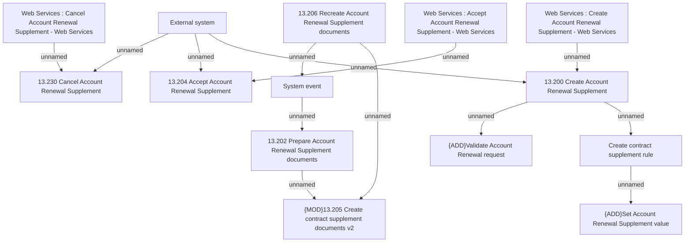

# REL Account renewal support - Use Case Model

```mermaid
graph TD
    n_13_206_Recreate_Account_Renewal_Supplement_documents["13.206 Recreate Account Renewal Supplement documents"]
    Web_Services_Cancel_Account_Renewal_Supplement_Web_Services["Web Services : Cancel Account Renewal Supplement - Web Services"]
    ADD_Validate_Account_Renewal_request["{ADD}Validate Account Renewal request"]
    System_event["System event"]
    n_13_202_Prepare_Account_Renewal_Supplement_documents["13.202 Prepare Account Renewal Supplement documents"]
    MOD_13_205_Create_contract_supplement_documents_v2["{MOD}13.205 Create contract supplement documents v2"]
    Web_Services_Accept_Account_Renewal_Supplement_Web_Services["Web Services : Accept Account Renewal Supplement - Web Services"]
    ADD_Set_Account_Renewal_Supplement_value["{ADD}Set Account Renewal Supplement value"]
    Create_contract_supplement_rule["Create contract supplement rule"]
    Web_Services_Create_Account_Renewal_Supplement_Web_Services["Web Services : Create Account Renewal Supplement - Web Services"]
    n_13_230_Cancel_Account_Renewal_Supplement["13.230 Cancel Account Renewal Supplement"]
    n_13_204_Accept_Account_Renewal_Supplement["13.204 Accept Account Renewal Supplement"]
    External_system["External system"]
    n_13_200_Create_Account_Renewal_Supplement["13.200 Create Account Renewal Supplement"]
    Web_Services_Create_Account_Renewal_Supplement_Web_Services -->|unnamed| n_13_200_Create_Account_Renewal_Supplement
    External_system -->|unnamed| n_13_200_Create_Account_Renewal_Supplement
    Web_Services_Accept_Account_Renewal_Supplement_Web_Services -->|unnamed| n_13_204_Accept_Account_Renewal_Supplement
    External_system -->|unnamed| n_13_204_Accept_Account_Renewal_Supplement
    External_system -->|unnamed| n_13_230_Cancel_Account_Renewal_Supplement
    Web_Services_Cancel_Account_Renewal_Supplement_Web_Services -->|unnamed| n_13_230_Cancel_Account_Renewal_Supplement
    n_13_200_Create_Account_Renewal_Supplement -->|unnamed| Create_contract_supplement_rule
    Create_contract_supplement_rule -->|unnamed| ADD_Set_Account_Renewal_Supplement_value
    n_13_206_Recreate_Account_Renewal_Supplement_documents -->|unnamed| MOD_13_205_Create_contract_supplement_documents_v2
    n_13_202_Prepare_Account_Renewal_Supplement_documents -->|unnamed| MOD_13_205_Create_contract_supplement_documents_v2
    System_event -->|unnamed| n_13_202_Prepare_Account_Renewal_Supplement_documents
    n_13_206_Recreate_Account_Renewal_Supplement_documents -->|unnamed| System_event
    n_13_200_Create_Account_Renewal_Supplement -->|unnamed| ADD_Validate_Account_Renewal_request
```
