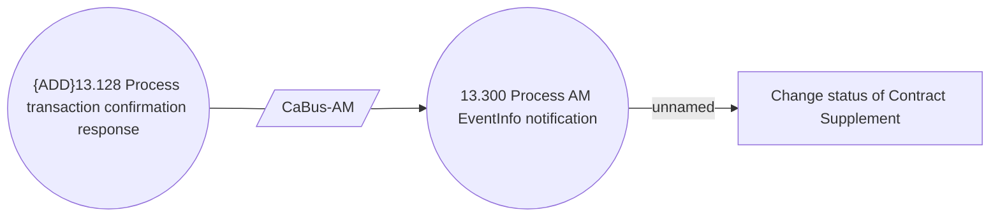

# Transaction Supplement - Account notification processing - Use case model

- **Diagram Type**: Use Case
- **Package**: HomerSelect/BSL/Analysis Model/Contract Supplements/Transaction Supplement support/Use case model
- **Diagram ID**: 164670
- **Elements**: 4
- **Connectors**: 3

