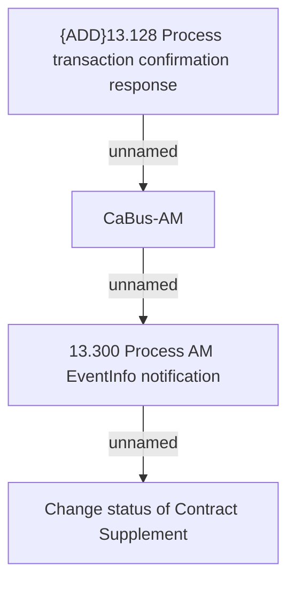

# Transaction Supplement - Account notification processing - Use case model

```mermaid
graph TD
    ADD_13_128_Process_transaction_confirmation_response["{ADD}13.128 Process transaction confirmation response"]
    Change_status_of_Contract_Supplement["Change status of Contract Supplement"]
    CaBus_AM["CaBus-AM"]
    n_13_300_Process_AM_EventInfo_notification["13.300 Process AM EventInfo notification"]
    n_13_300_Process_AM_EventInfo_notification -->|unnamed| Change_status_of_Contract_Supplement
    CaBus_AM -->|unnamed| n_13_300_Process_AM_EventInfo_notification
    ADD_13_128_Process_transaction_confirmation_response -->|unnamed| CaBus_AM
```
