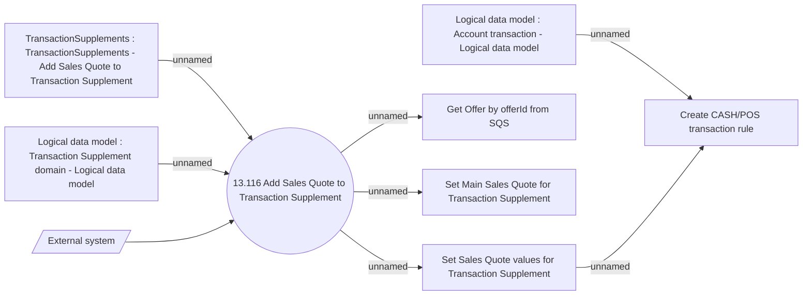

# Transaction Supplement Sales Quote adding

- **Diagram Type**: Use Case
- **Package**: HomerSelect/BSL/Analysis Model/Contract Supplements/Transaction Supplement support/Use case model
- **Diagram ID**: 164674
- **Elements**: 9
- **Connectors**: 8

