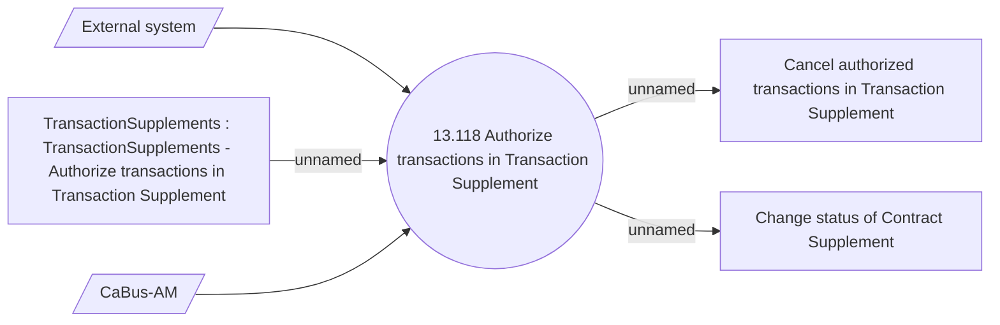

# Transaction Supplement authorization method

- **Diagram Type**: Use Case
- **Package**: HomerSelect/BSL/Analysis Model/Contract Supplements/Transaction Supplement support/Use case model
- **Diagram ID**: 164665
- **Elements**: 6
- **Connectors**: 5

