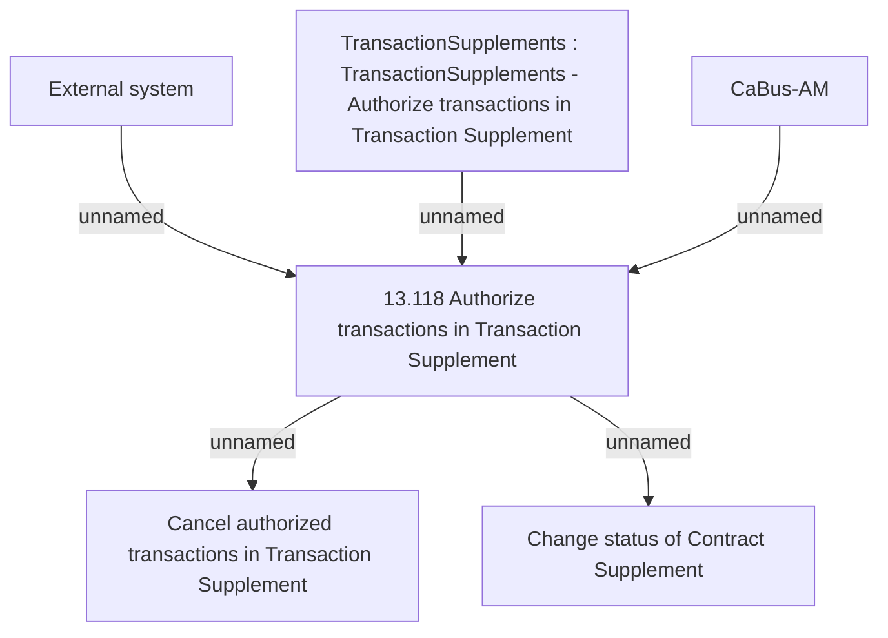

# Transaction Supplement authorization method

```mermaid
graph TD
    Cancel_authorized_transactions_in_Transaction_Supplement["Cancel authorized transactions in Transaction Supplement"]
    Change_status_of_Contract_Supplement["Change status of Contract Supplement"]
    CaBus_AM["CaBus-AM"]
    TransactionSupplements_TransactionSupplements_Authorize_tran["TransactionSupplements : TransactionSupplements - Authorize transactions in Transaction Supplement"]
    External_system["External system"]
    n_13_118_Authorize_transactions_in_Transaction_Supplement["13.118 Authorize transactions in Transaction Supplement"]
    n_13_118_Authorize_transactions_in_Transaction_Supplement -->|unnamed| Cancel_authorized_transactions_in_Transaction_Supplement
    n_13_118_Authorize_transactions_in_Transaction_Supplement -->|unnamed| Change_status_of_Contract_Supplement
    External_system -->|unnamed| n_13_118_Authorize_transactions_in_Transaction_Supplement
    TransactionSupplements_TransactionSupplements_Authorize_tran -->|unnamed| n_13_118_Authorize_transactions_in_Transaction_Supplement
    CaBus_AM -->|unnamed| n_13_118_Authorize_transactions_in_Transaction_Supplement
```
