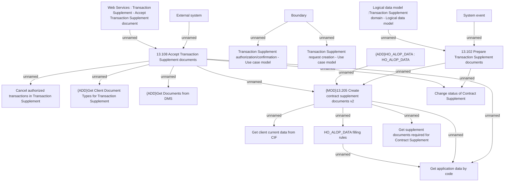

# Transaction Supplement documents - Use case model 

```mermaid
graph TD
    Cancel_authorized_transactions_in_Transaction_Supplement["Cancel authorized transactions in Transaction Supplement"]
    ADD_Get_Client_Document_Types_for_Transaction_Supplement["{ADD}Get Client Document Types for Transaction Supplement"]
    ADD_Get_Documents_from_DMS["{ADD}Get Documents from DMS"]
    Get_application_data_by_code["Get application data by code"]
    Get_client_current_data_from_CIF["Get client current data from CIF"]
    Web_Services_Transaction_Supplement_Accept_Transaction_Suppl["Web Services : Transaction Supplement - Accept Transaction Supplement document"]
    HO_ALOP_DATA_filling_rules["HO_ALOP_DATA filling rules"]
    MOD_13_205_Create_contract_supplement_documents_v2["{MOD}13.205 Create contract supplement documents v2"]
    ADD_HO_ALOP_DATA_HO_ALOP_DATA["{ADD}HO_ALOP_DATA : HO_ALOP_DATA"]
    Logical_data_model_Transaction_Supplement_domain_Logical_dat["Logical data model :Transaction Supplement domain - Logical data model"]
    Transaction_Supplement_authorization_confirmation_Use_case_m["Transaction Supplement authorization/confirmation - Use case model"]
    Transaction_Supplement_request_creation_Use_case_model["Transaction Supplement request creation - Use case model"]
    Change_status_of_Contract_Supplement["Change status of Contract Supplement"]
    Get_supplement_documents_required_for_Contract_Supplement["Get supplement documents required for Contract Supplement"]
    External_system["External system"]
    n_13_108_Accept_Transaction_Supplement_documents["13.108 Accept Transaction Supplement documents"]
    n_13_102_Prepare_Transaction_Supplement_documents["13.102 Prepare Transaction Supplement documents"]
    System_event["System event"]
    el_1881450["Boundary"]
    n_13_108_Accept_Transaction_Supplement_documents -->|unnamed| MOD_13_205_Create_contract_supplement_documents_v2
    HO_ALOP_DATA_filling_rules -->|unnamed| Get_application_data_by_code
    MOD_13_205_Create_contract_supplement_documents_v2 -->|unnamed| Get_client_current_data_from_CIF
    MOD_13_205_Create_contract_supplement_documents_v2 -->|unnamed| Get_application_data_by_code
    MOD_13_205_Create_contract_supplement_documents_v2 -->|unnamed| HO_ALOP_DATA_filling_rules
    MOD_13_205_Create_contract_supplement_documents_v2 -->|unnamed| Get_supplement_documents_required_for_Contract_Supplement
    ADD_HO_ALOP_DATA_HO_ALOP_DATA -->|unnamed| MOD_13_205_Create_contract_supplement_documents_v2
    Logical_data_model_Transaction_Supplement_domain_Logical_dat -->|unnamed| n_13_102_Prepare_Transaction_Supplement_documents
    Web_Services_Transaction_Supplement_Accept_Transaction_Suppl -->|unnamed| n_13_108_Accept_Transaction_Supplement_documents
    n_13_108_Accept_Transaction_Supplement_documents -->|unnamed| Get_application_data_by_code
    el_1881450 -->|unnamed| Transaction_Supplement_request_creation_Use_case_model
    n_13_108_Accept_Transaction_Supplement_documents -->|unnamed| Cancel_authorized_transactions_in_Transaction_Supplement
    n_13_108_Accept_Transaction_Supplement_documents -->|unnamed| Change_status_of_Contract_Supplement
    n_13_108_Accept_Transaction_Supplement_documents -->|unnamed| ADD_Get_Documents_from_DMS
    n_13_108_Accept_Transaction_Supplement_documents -->|unnamed| ADD_Get_Client_Document_Types_for_Transaction_Supplement
    n_13_102_Prepare_Transaction_Supplement_documents -->|unnamed| MOD_13_205_Create_contract_supplement_documents_v2
    n_13_102_Prepare_Transaction_Supplement_documents -->|unnamed| Change_status_of_Contract_Supplement
    System_event -->|unnamed| n_13_102_Prepare_Transaction_Supplement_documents
    el_1881450 -->|unnamed| Transaction_Supplement_authorization_confirmation_Use_case_m
    External_system -->|unnamed| n_13_108_Accept_Transaction_Supplement_documents
```
