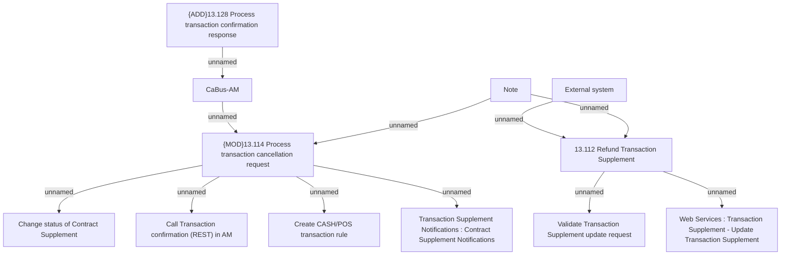

# Transaction Supplement refunding - Use case model

```mermaid
graph TD
    ADD_13_128_Process_transaction_confirmation_response["{ADD}13.128 Process transaction confirmation response"]
    Call_Transaction_confirmation_REST_in_AM["Call Transaction confirmation (REST) in AM"]
    Transaction_Supplement_Notifications_Contract_Supplement_Not["Transaction Supplement Notifications : Contract Supplement Notifications"]
    el_1881445["Note"]
    Create_CASH_POS_transaction_rule["Create CASH/POS transaction rule"]
    CaBus_AM["CaBus-AM"]
    MOD_13_114_Process_transaction_cancellation_request["{MOD}13.114 Process transaction cancellation request"]
    Change_status_of_Contract_Supplement["Change status of Contract Supplement"]
    Web_Services_Transaction_Supplement_Update_Transaction_Suppl["Web Services : Transaction Supplement - Update Transaction Supplement"]
    Validate_Transaction_Supplement_update_request["Validate Transaction Supplement update request"]
    External_system["External system"]
    n_13_112_Refund_Transaction_Supplement["13.112 Refund Transaction Supplement"]
    n_13_112_Refund_Transaction_Supplement -->|unnamed| Validate_Transaction_Supplement_update_request
    n_13_112_Refund_Transaction_Supplement -->|unnamed| Web_Services_Transaction_Supplement_Update_Transaction_Suppl
    External_system -->|unnamed| n_13_112_Refund_Transaction_Supplement
    MOD_13_114_Process_transaction_cancellation_request -->|unnamed| Change_status_of_Contract_Supplement
    MOD_13_114_Process_transaction_cancellation_request -->|unnamed| Call_Transaction_confirmation_REST_in_AM
    MOD_13_114_Process_transaction_cancellation_request -->|unnamed| Create_CASH_POS_transaction_rule
    MOD_13_114_Process_transaction_cancellation_request -->|unnamed| Transaction_Supplement_Notifications_Contract_Supplement_Not
    CaBus_AM -->|unnamed| MOD_13_114_Process_transaction_cancellation_request
    el_1881445 -->|unnamed| n_13_112_Refund_Transaction_Supplement
    el_1881445 -->|unnamed| MOD_13_114_Process_transaction_cancellation_request
    ADD_13_128_Process_transaction_confirmation_response -->|unnamed| CaBus_AM
```
