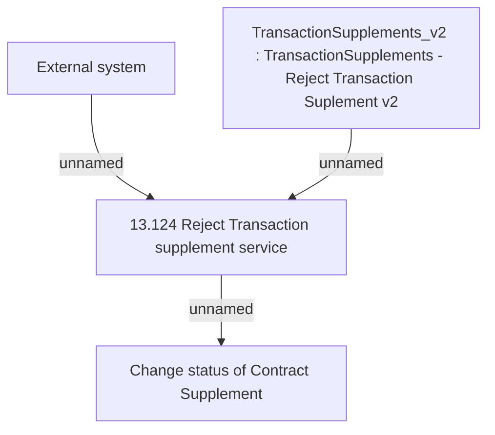

# Transaction Supplement rejection - Use case model

```mermaid
graph TD
    Change_status_of_Contract_Supplement["Change status of Contract Supplement"]
    TransactionSupplements_v2_TransactionSupplements_Reject_Tran["TransactionSupplements_v2 : TransactionSupplements - Reject Transaction Suplement v2"]
    External_system["External system"]
    n_13_124_Reject_Transaction_supplement_service["13.124 Reject Transaction supplement service"]
    n_13_124_Reject_Transaction_supplement_service -->|unnamed| Change_status_of_Contract_Supplement
    External_system -->|unnamed| n_13_124_Reject_Transaction_supplement_service
    TransactionSupplements_v2_TransactionSupplements_Reject_Tran -->|unnamed| n_13_124_Reject_Transaction_supplement_service
```
