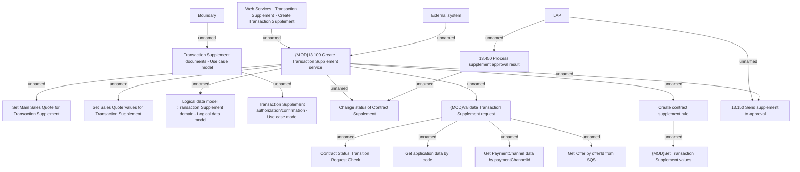

# Transaction Supplement request creation - Use case model

```mermaid
graph TD
    Set_Main_Sales_Quote_for_Transaction_Supplement["Set Main Sales Quote for Transaction Supplement"]
    Set_Sales_Quote_values_for_Transaction_Supplement["Set Sales Quote values for Transaction Supplement"]
    Logical_data_model_Transaction_Supplement_domain_Logical_dat["Logical data model :Transaction Supplement domain - Logical data model"]
    Web_Services_Transaction_Supplement_Create_Transaction_Suppl["Web Services : Transaction Supplement - Create Transaction Supplement"]
    Get_PaymentChannel_data_by_paymentChannelId["Get PaymentChannel data by paymentChannelId"]
    Get_application_data_by_code["Get application data by code"]
    Transaction_Supplement_authorization_confirmation_Use_case_m["Transaction Supplement authorization/confirmation - Use case model"]
    Transaction_Supplement_documents_Use_case_model["Transaction Supplement documents - Use case model "]
    Change_status_of_Contract_Supplement["Change status of Contract Supplement"]
    n_13_450_Process_supplement_approval_result["13.450 Process supplement approval result"]
    Contract_Status_Transition_Request_Check["Contract Status Transition Request Check"]
    MOD_Set_Transaction_Supplement_values["{MOD}Set Transaction Supplement values"]
    Create_contract_supplement_rule["Create contract supplement rule"]
    Get_Offer_by_offerId_from_SQS["Get Offer by offerId from SQS"]
    MOD_Validate_Transaction_Supplement_request["{MOD}Validate Transaction Supplement request"]
    n_13_150_Send_supplement_to_approval["13.150 Send supplement to approval"]
    LAP["LAP"]
    External_system["External system"]
    MOD_13_100_Create_Transaction_Supplement_service["{MOD}13.100 Create Transaction Supplement service"]
    el_1881452["Boundary"]
    External_system -->|unnamed| MOD_13_100_Create_Transaction_Supplement_service
    Transaction_Supplement_documents_Use_case_model -->|unnamed| Transaction_Supplement_authorization_confirmation_Use_case_m
    n_13_450_Process_supplement_approval_result -->|unnamed| Change_status_of_Contract_Supplement
    Create_contract_supplement_rule -->|unnamed| MOD_Set_Transaction_Supplement_values
    MOD_Validate_Transaction_Supplement_request -->|unnamed| Contract_Status_Transition_Request_Check
    MOD_Validate_Transaction_Supplement_request -->|unnamed| Get_application_data_by_code
    MOD_Validate_Transaction_Supplement_request -->|unnamed| Get_PaymentChannel_data_by_paymentChannelId
    MOD_Validate_Transaction_Supplement_request -->|unnamed| Get_Offer_by_offerId_from_SQS
    Web_Services_Transaction_Supplement_Create_Transaction_Suppl -->|unnamed| MOD_13_100_Create_Transaction_Supplement_service
    LAP -->|unnamed| n_13_450_Process_supplement_approval_result
    el_1881452 -->|unnamed| Transaction_Supplement_documents_Use_case_model
    MOD_13_100_Create_Transaction_Supplement_service -->|unnamed| Logical_data_model_Transaction_Supplement_domain_Logical_dat
    MOD_13_100_Create_Transaction_Supplement_service -->|unnamed| MOD_Validate_Transaction_Supplement_request
    MOD_13_100_Create_Transaction_Supplement_service -->|unnamed| Create_contract_supplement_rule
    MOD_13_100_Create_Transaction_Supplement_service -->|unnamed| Set_Sales_Quote_values_for_Transaction_Supplement
    MOD_13_100_Create_Transaction_Supplement_service -->|unnamed| n_13_150_Send_supplement_to_approval
    MOD_13_100_Create_Transaction_Supplement_service -->|unnamed| Set_Main_Sales_Quote_for_Transaction_Supplement
    MOD_13_100_Create_Transaction_Supplement_service -->|unnamed| Change_status_of_Contract_Supplement
    LAP -->|unnamed| n_13_150_Send_supplement_to_approval
```
