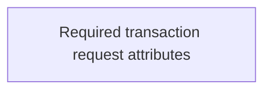

# Transaction Supplement test cases

- **Diagram Type**: Use Case
- **Package**: HomerSelect/BSL/Analysis Model/Contract Supplements/Transaction Supplement support/Use case model
- **Diagram ID**: 164671
- **Elements**: 1
- **Connectors**: 0

