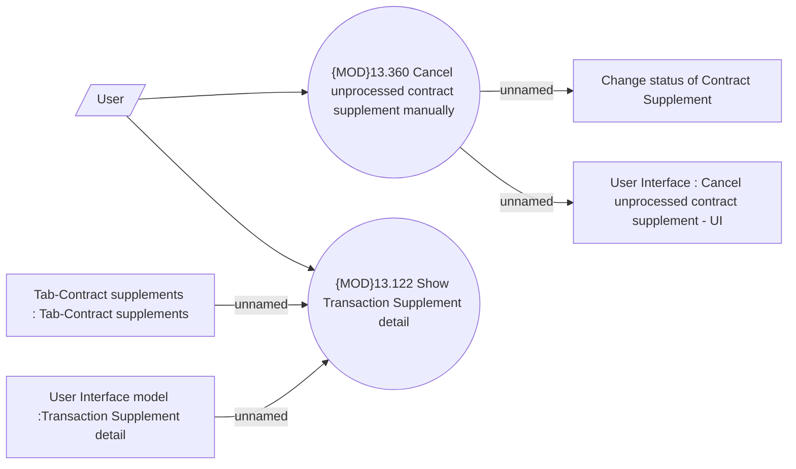

# Transaction Supplement user interface

- **Diagram Type**: Use Case
- **Package**: HomerSelect/BSL/Analysis Model/Contract Supplements/Transaction Supplement support/Use case model
- **Diagram ID**: 164672
- **Elements**: 7
- **Connectors**: 6

