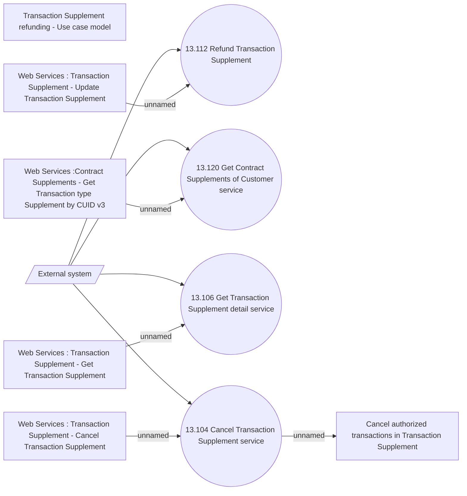

# Transaction Supplements management services - Use case model

- **Diagram Type**: Use Case
- **Package**: HomerSelect/BSL/Analysis Model/Contract Supplements/Transaction Supplement support/Use case model
- **Diagram ID**: 164667
- **Elements**: 11
- **Connectors**: 9

