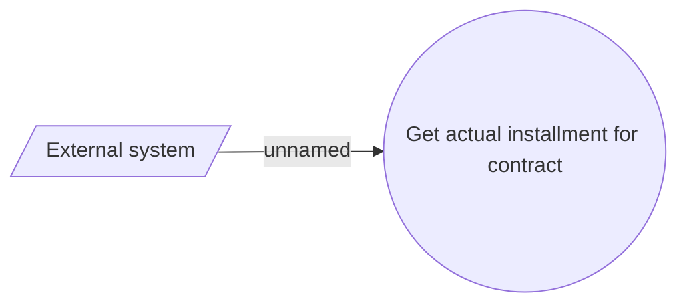

# Actual installment

- **Diagram Type**: Use Case
- **Package**: HomerSelect/BSL/Analysis Model/Installment Schedule/Actual installment/Use case
- **Diagram ID**: 159703
- **Elements**: 2
- **Connectors**: 1

