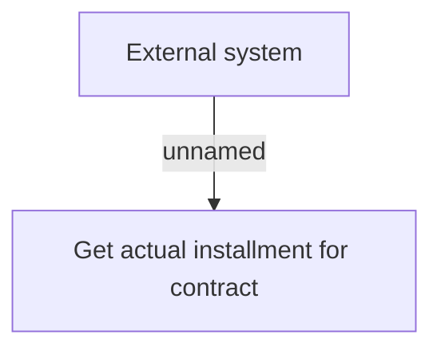

# Actual installment

```mermaid
graph TD
    External_system["External system"]
    Get_actual_installment_for_contract["Get actual installment for contract"]
    External_system -->|unnamed| Get_actual_installment_for_contract
```
