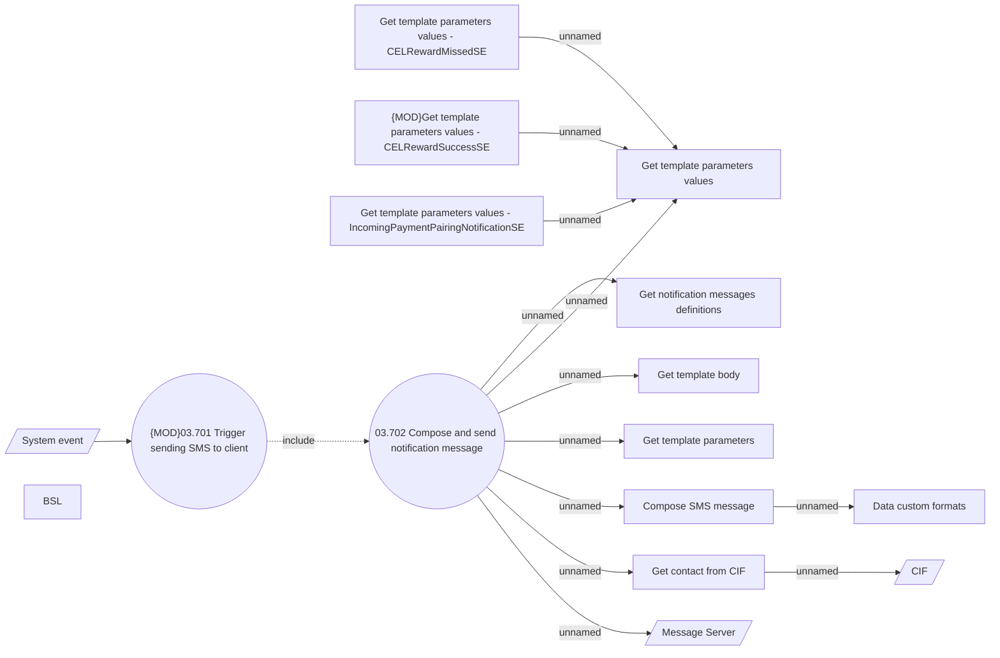

# SMS notification

- **Diagram Type**: Use Case
- **Package**: HomerSelect/BSL/Analysis Model/Installment Schedule/COMMON for Installment Schedule/Client notifications/UseCase Model
- **Diagram ID**: 163445
- **Elements**: 16
- **Connectors**: 14

