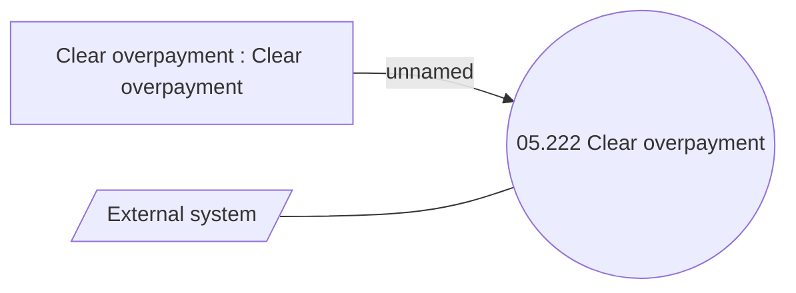

# Clear overpayment

- **Diagram Type**: Use Case
- **Package**: HomerSelect/BSL/Analysis Model/Installment Schedule/Clear overpayment/Use case
- **Diagram ID**: 164439
- **Elements**: 3
- **Connectors**: 2

