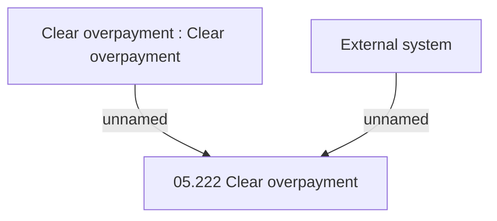

# Clear overpayment

```mermaid
graph TD
    Clear_overpayment_Clear_overpayment["Clear overpayment : Clear overpayment"]
    External_system["External system"]
    n_05_222_Clear_overpayment["05.222 Clear overpayment"]
    Clear_overpayment_Clear_overpayment -->|unnamed| n_05_222_Clear_overpayment
    External_system -->|unnamed| n_05_222_Clear_overpayment
```
