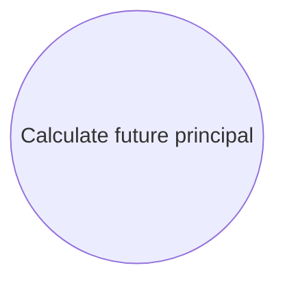

# Fee Deduction

- **Diagram Type**: Use Case
- **Package**: HomerSelect/BSL/Analysis Model/Installment Schedule/Fee Deduction/Use Case Model
- **Diagram ID**: 149359
- **Elements**: 1
- **Connectors**: 0

