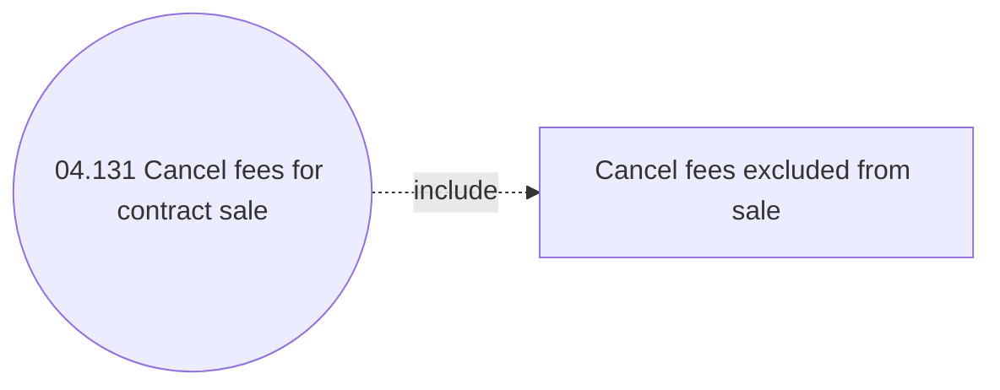

# Cancel fees for contract sale

- **Diagram Type**: Use Case
- **Package**: HomerSelect/BSL/Analysis Model/Installment Schedule/Fees and Penalties/Cancel fees for contract sale/Use case
- **Diagram ID**: 159975
- **Elements**: 2
- **Connectors**: 1

