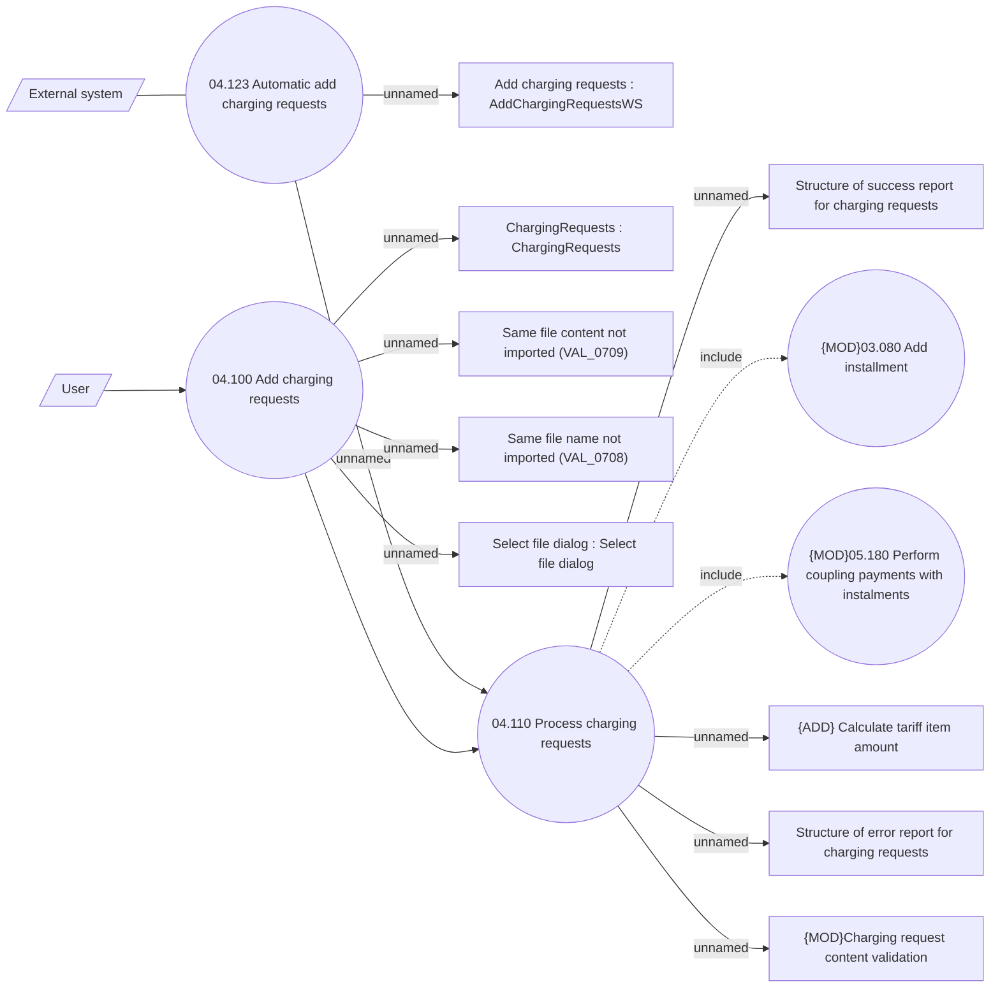

# Charging request

- **Diagram Type**: Use Case
- **Package**: HomerSelect/BSL/Analysis Model/Installment Schedule/Fees and Penalties/Charging request/Use Case
- **Diagram ID**: 162151
- **Elements**: 16
- **Connectors**: 15

