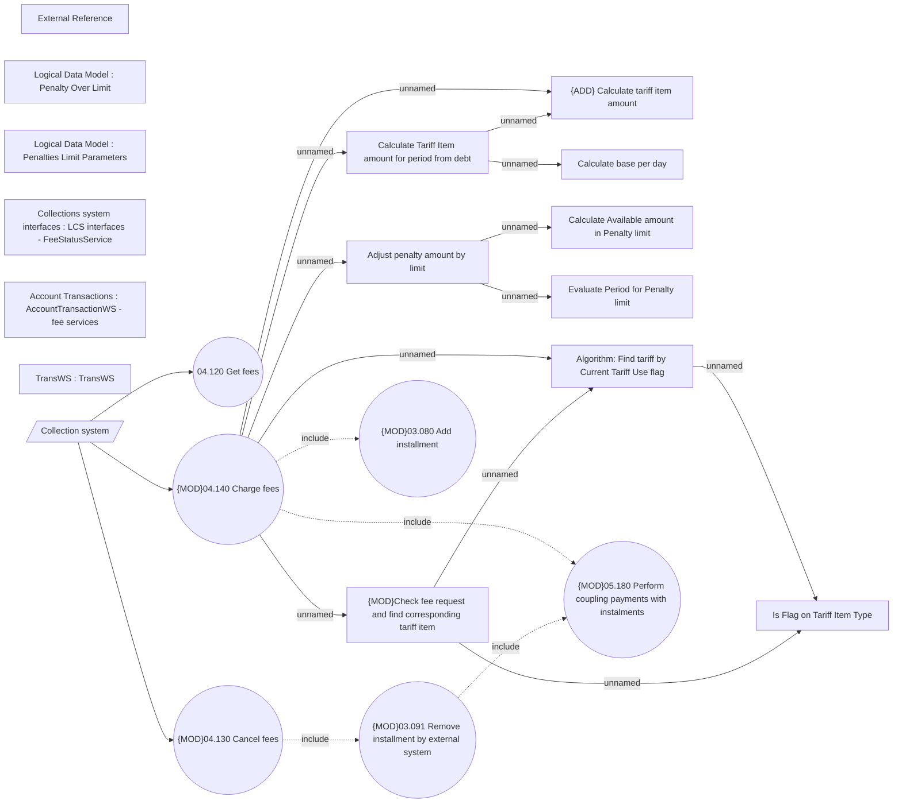

# Fee services used by external system (Collection)

- **Diagram Type**: Use Case
- **Package**: HomerSelect/BSL/Analysis Model/Installment Schedule/Fees and Penalties/Charging request/Use Case
- **Diagram ID**: 162152
- **Elements**: 23
- **Connectors**: 19

