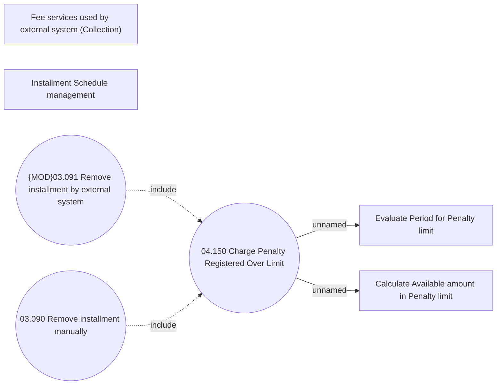

# Charging Penalty Over Limit

- **Diagram Type**: Use Case
- **Package**: HomerSelect/BSL/Analysis Model/Installment Schedule/Fees and Penalties/Penalty Limit/Use Case
- **Diagram ID**: 159982
- **Elements**: 7
- **Connectors**: 4

