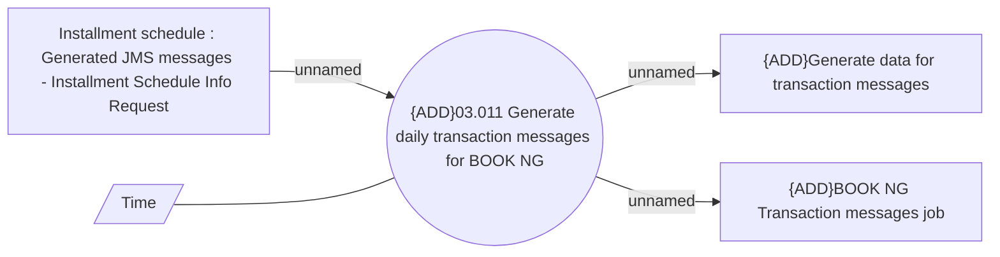

# Daily ISIR generating for BOOK NG

- **Diagram Type**: Use Case
- **Package**: HomerSelect/BSL/Analysis Model/Installment Schedule/Installment Schedule/Use Case Model
- **Diagram ID**: 164464
- **Elements**: 5
- **Connectors**: 4

