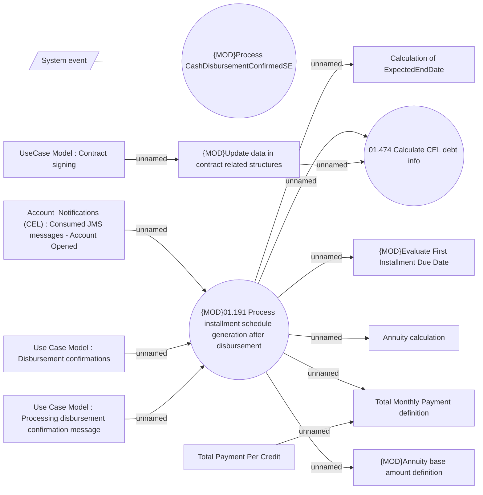

# Determine installment schedule processing

- **Diagram Type**: Use Case
- **Package**: HomerSelect/BSL/Analysis Model/Installment Schedule/Installment Schedule/Use Case Model
- **Diagram ID**: 164460
- **Elements**: 15
- **Connectors**: 13

