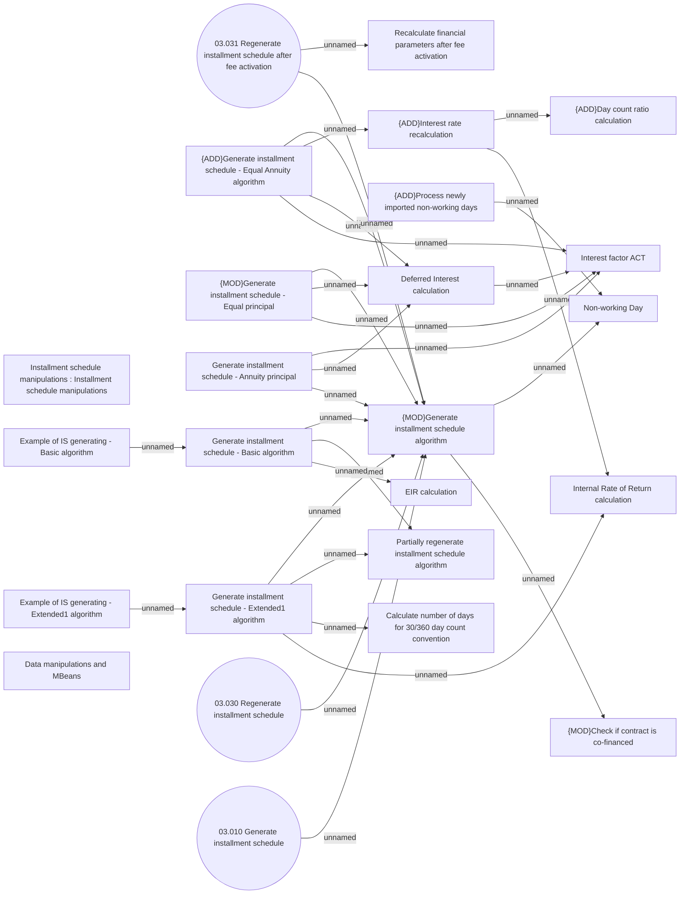

# Generate installment schedule

- **Diagram Type**: Use Case
- **Package**: HomerSelect/BSL/Analysis Model/Installment Schedule/Installment Schedule/Use Case Model
- **Diagram ID**: 164463
- **Elements**: 25
- **Connectors**: 29

