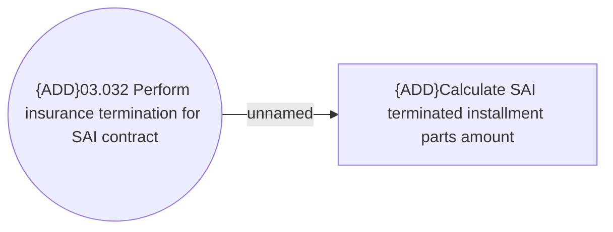

# Terminate insurance for SAI contract

- **Diagram Type**: Use Case
- **Package**: HomerSelect/BSL/Analysis Model/Installment Schedule/Installment Schedule/Use Case Model
- **Diagram ID**: 164465
- **Elements**: 2
- **Connectors**: 1

