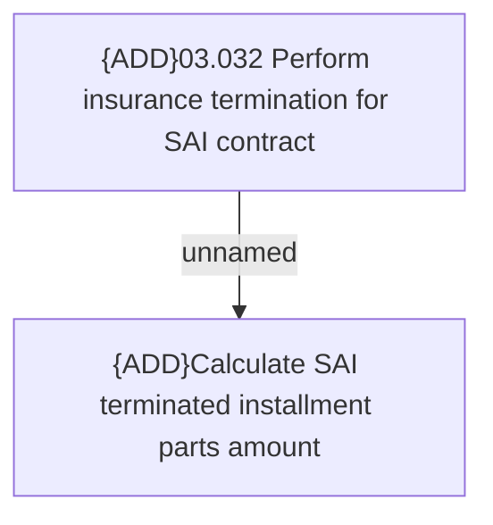

# Terminate insurance for SAI contract

```mermaid
graph TD
    ADD_Calculate_SAI_terminated_installment_parts_amount["{ADD}Calculate SAI terminated installment parts amount"]
    ADD_03_032_Perform_insurance_termination_for_SAI_contract["{ADD}03.032 Perform insurance termination for SAI contract"]
    ADD_03_032_Perform_insurance_termination_for_SAI_contract -->|unnamed| ADD_Calculate_SAI_terminated_installment_parts_amount
```
