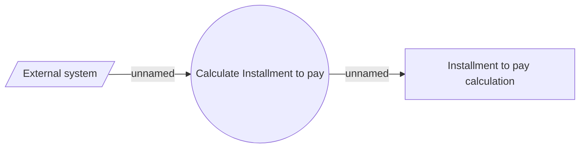

# Installment to pay

- **Diagram Type**: Use Case
- **Package**: HomerSelect/BSL/Analysis Model/Installment Schedule/Installment to pay/Use case
- **Diagram ID**: 157650
- **Elements**: 3
- **Connectors**: 2

