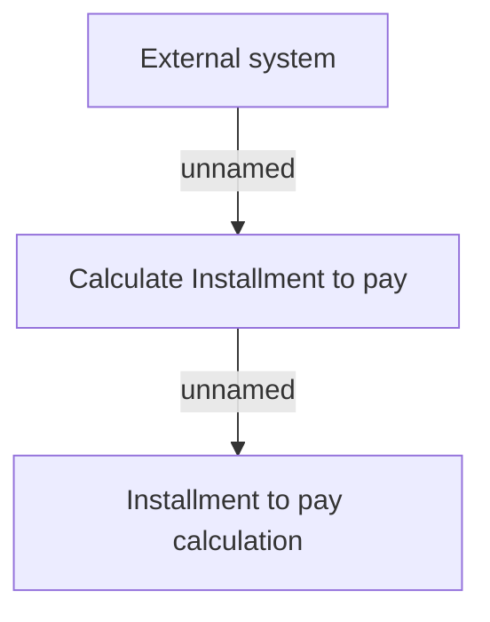

# Installment to pay

```mermaid
graph TD
    Installment_to_pay_calculation["Installment to pay calculation"]
    External_system["External system"]
    Calculate_Installment_to_pay["Calculate Installment to pay"]
    Calculate_Installment_to_pay -->|unnamed| Installment_to_pay_calculation
    External_system -->|unnamed| Calculate_Installment_to_pay
```
