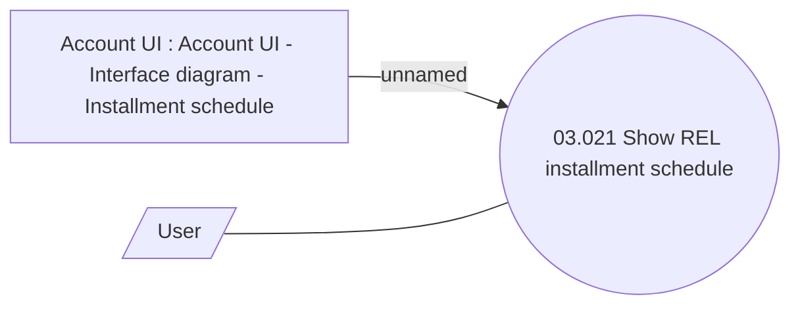

# Use Case Model

- **Diagram Type**: Use Case
- **Package**: HomerSelect/BSL/Analysis Model/Installment Schedule/REL Installment Schedule/Use Case Model
- **Diagram ID**: 133199
- **Elements**: 3
- **Connectors**: 2

