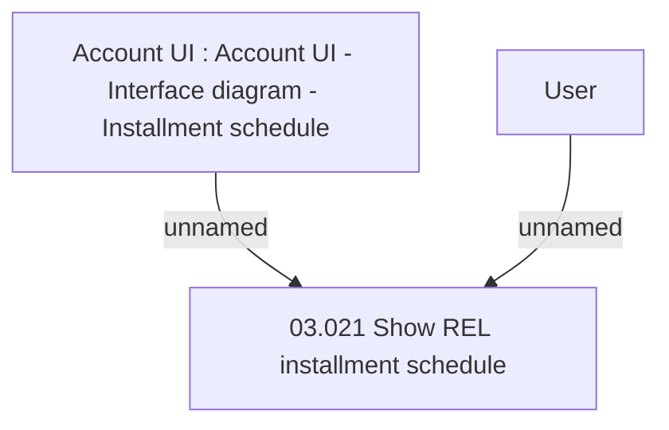

# Use Case Model

```mermaid
graph TD
    Account_UI_Account_UI_Interface_diagram_Installment_schedule["Account UI : Account UI - Interface diagram - Installment schedule"]
    User["User"]
    n_03_021_Show_REL_installment_schedule["03.021 Show REL installment schedule"]
    Account_UI_Account_UI_Interface_diagram_Installment_schedule -->|unnamed| n_03_021_Show_REL_installment_schedule
    User -->|unnamed| n_03_021_Show_REL_installment_schedule
```
