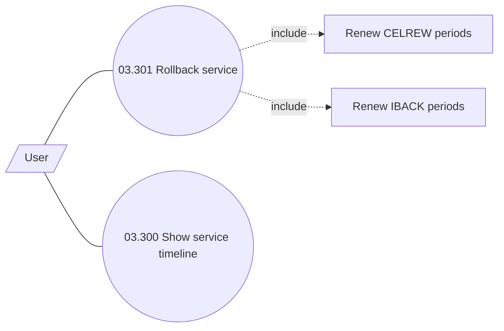

# Service timeline

- **Diagram Type**: Use Case
- **Package**: HomerSelect/BSL/Analysis Model/Installment Schedule/Service timeline/Use case model
- **Diagram ID**: 163990
- **Elements**: 5
- **Connectors**: 4

