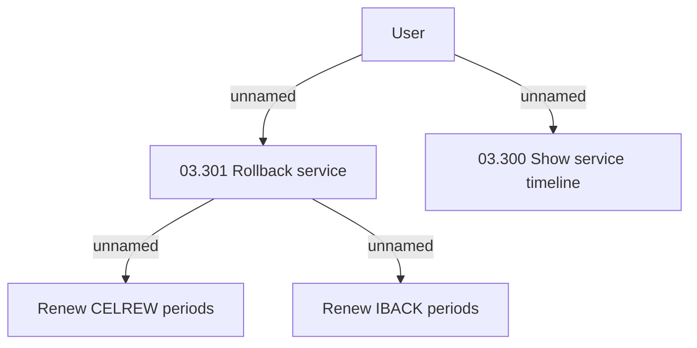

# Service timeline

```mermaid
graph TD
    Renew_IBACK_periods["Renew IBACK periods"]
    Renew_CELREW_periods["Renew CELREW periods"]
    n_03_301_Rollback_service["03.301 Rollback service"]
    n_03_300_Show_service_timeline["03.300 Show service timeline"]
    User["User"]
    User -->|unnamed| n_03_300_Show_service_timeline
    User -->|unnamed| n_03_301_Rollback_service
    n_03_301_Rollback_service -->|unnamed| Renew_CELREW_periods
    n_03_301_Rollback_service -->|unnamed| Renew_IBACK_periods
```
