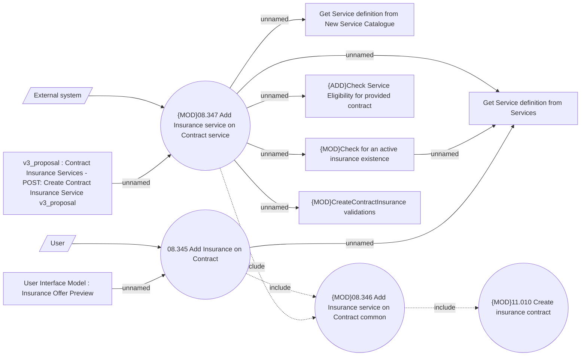

# Adding Insurance Service on CEL contract

- **Diagram Type**: Use Case
- **Package**: HomerSelect/BSL/Analysis Model/Insurance/Insurance Contract/Adding Insurance on running contract/Use Case Model
- **Diagram ID**: 164519
- **Elements**: 13
- **Connectors**: 14

