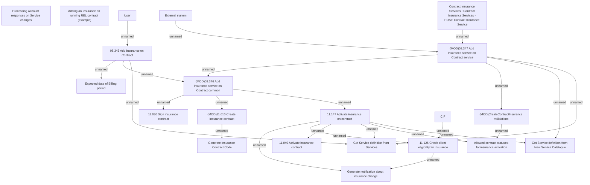

# Adding Insurance Service on REL contract

```mermaid
graph TD
    Processing_Account_responses_on_Service_changes["Processing Account responses on Service changes"]
    Get_Service_definition_from_Services["Get Service definition from Services"]
    Get_Service_definition_from_New_Service_Catalogue["Get Service definition from New Service Catalogue"]
    Adding_an_Insurance_on_running_REL_contract_example["Adding an Insurance on running REL contract (example)"]
    Allowed_contract_statuses_for_insurance_activation["Allowed contract statuses for insurance activation"]
    MOD_CreateContractInsurance_validations["{MOD}CreateContractInsurance validations"]
    MOD_08_346_Add_Insurance_service_on_Contract_common["{MOD}08.346 Add Insurance service on Contract common"]
    Contract_Insurance_Services_Contract_Insurance_Services_POST["Contract Insurance Services : Contract Insurance Services - POST: Contract Insurance Service"]
    External_system["External system"]
    n_11_030_Sign_insurance_contract["11.030 Sign insurance contract"]
    n_11_147_Activate_insurance_on_contract["11.147 Activate insurance on contract"]
    Generate_Insurance_Contract_Code["Generate Insurance Contract Code"]
    MOD_11_010_Create_insurance_contract["{MOD}11.010 Create insurance contract"]
    Expected_date_of_Billing_period["Expected date of Billing period"]
    CIF["CIF"]
    User["User"]
    n_11_040_Activate_insurance_contract["11.040 Activate insurance contract"]
    n_11_126_Check_client_eligibility_for_insurance["11.126 Check client eligibility for insurance"]
    Generate_notification_about_insurance_change["Generate notification about insurance change"]
    MOD_08_347_Add_Insurance_service_on_Contract_service["{MOD}08.347 Add Insurance service on Contract service"]
    n_08_345_Add_Insurance_on_Contract["08.345 Add Insurance on Contract"]
    MOD_11_010_Create_insurance_contract -->|unnamed| Generate_Insurance_Contract_Code
    MOD_08_347_Add_Insurance_service_on_Contract_service -->|unnamed| Get_Service_definition_from_Services
    n_08_345_Add_Insurance_on_Contract -->|unnamed| Get_Service_definition_from_Services
    n_11_147_Activate_insurance_on_contract -->|unnamed| Get_Service_definition_from_New_Service_Catalogue
    MOD_08_347_Add_Insurance_service_on_Contract_service -->|unnamed| Get_Service_definition_from_New_Service_Catalogue
    n_11_147_Activate_insurance_on_contract -->|unnamed| Allowed_contract_statuses_for_insurance_activation
    MOD_CreateContractInsurance_validations -->|unnamed| Allowed_contract_statuses_for_insurance_activation
    MOD_08_347_Add_Insurance_service_on_Contract_service -->|unnamed| MOD_CreateContractInsurance_validations
    n_08_345_Add_Insurance_on_Contract -->|unnamed| MOD_08_346_Add_Insurance_service_on_Contract_common
    MOD_08_347_Add_Insurance_service_on_Contract_service -->|unnamed| MOD_08_346_Add_Insurance_service_on_Contract_common
    n_11_147_Activate_insurance_on_contract -->|unnamed| Get_Service_definition_from_Services
    MOD_08_346_Add_Insurance_service_on_Contract_common -->|unnamed| n_11_147_Activate_insurance_on_contract
    MOD_08_346_Add_Insurance_service_on_Contract_common -->|unnamed| MOD_11_010_Create_insurance_contract
    n_08_345_Add_Insurance_on_Contract -->|unnamed| Expected_date_of_Billing_period
    n_11_147_Activate_insurance_on_contract -->|unnamed| n_11_040_Activate_insurance_contract
    n_11_147_Activate_insurance_on_contract -->|unnamed| n_11_126_Check_client_eligibility_for_insurance
    n_11_126_Check_client_eligibility_for_insurance -->|unnamed| Generate_notification_about_insurance_change
    n_11_147_Activate_insurance_on_contract -->|unnamed| Generate_notification_about_insurance_change
    Contract_Insurance_Services_Contract_Insurance_Services_POST -->|unnamed| MOD_08_347_Add_Insurance_service_on_Contract_service
    MOD_08_346_Add_Insurance_service_on_Contract_common -->|unnamed| n_11_030_Sign_insurance_contract
    User -->|unnamed| n_08_345_Add_Insurance_on_Contract
    CIF -->|unnamed| n_11_126_Check_client_eligibility_for_insurance
    External_system -->|unnamed| MOD_08_347_Add_Insurance_service_on_Contract_service
```
