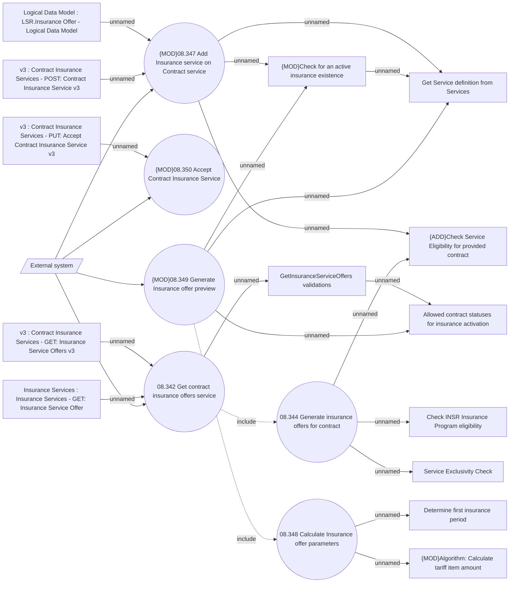

# Insurance Service Offers API - Use Case Model

- **Diagram Type**: Use Case
- **Package**: HomerSelect/BSL/Analysis Model/Insurance/Insurance Contract/Adding Insurance on running contract/Use Case Model
- **Diagram ID**: 164517
- **Elements**: 21
- **Connectors**: 25

