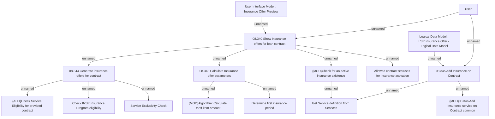

# Insurance Service Offers UI - Use Case Model

```mermaid
graph TD
    MOD_08_346_Add_Insurance_service_on_Contract_common["{MOD}08.346 Add Insurance service on Contract common"]
    Logical_Data_Model_LSR_Insurance_Offer_Logical_Data_Model["Logical Data Model : LSR.Insurance Offer - Logical Data Model"]
    MOD_Algorithm_Calculate_tariff_item_amount["{MOD}Algorithm: Calculate tariff item amount"]
    Determine_first_insurance_period["Determine first insurance period"]
    n_08_345_Add_Insurance_on_Contract["08.345 Add Insurance on Contract"]
    ADD_Check_Service_Eligibility_for_provided_contract["{ADD}Check Service Eligibility for provided contract"]
    Service_Exclusivity_Check["Service Exclusivity Check"]
    Check_INSR_Insurance_Program_eligibility["Check INSR Insurance Program eligibility"]
    n_08_344_Generate_insurance_offers_for_contract["08.344 Generate insurance offers for contract"]
    MOD_Check_for_an_active_insurance_existence["{MOD}Check for an active insurance existence"]
    Allowed_contract_statuses_for_insurance_activation["Allowed contract statuses for insurance activation"]
    Get_Service_definition_from_Services["Get Service definition from Services"]
    n_08_340_Show_Insurance_offers_for_loan_contract["08.340 Show Insurance offers for loan contract"]
    User["User"]
    User_Interface_Model_Insurance_Offer_Preview["User Interface Model : Insurance Offer Preview"]
    n_08_348_Calculate_Insurance_offer_parameters["08.348 Calculate Insurance offer parameters"]
    n_08_340_Show_Insurance_offers_for_loan_contract -->|unnamed| n_08_344_Generate_insurance_offers_for_contract
    n_08_348_Calculate_Insurance_offer_parameters -->|unnamed| MOD_Algorithm_Calculate_tariff_item_amount
    n_08_348_Calculate_Insurance_offer_parameters -->|unnamed| Determine_first_insurance_period
    Logical_Data_Model_LSR_Insurance_Offer_Logical_Data_Model -->|unnamed| n_08_345_Add_Insurance_on_Contract
    n_08_344_Generate_insurance_offers_for_contract -->|unnamed| ADD_Check_Service_Eligibility_for_provided_contract
    n_08_345_Add_Insurance_on_Contract -->|unnamed| MOD_08_346_Add_Insurance_service_on_Contract_common
    n_08_344_Generate_insurance_offers_for_contract -->|unnamed| Check_INSR_Insurance_Program_eligibility
    n_08_340_Show_Insurance_offers_for_loan_contract -->|unnamed| n_08_348_Calculate_Insurance_offer_parameters
    n_08_340_Show_Insurance_offers_for_loan_contract -->|unnamed| MOD_Check_for_an_active_insurance_existence
    n_08_340_Show_Insurance_offers_for_loan_contract -->|unnamed| Allowed_contract_statuses_for_insurance_activation
    MOD_Check_for_an_active_insurance_existence -->|unnamed| Get_Service_definition_from_Services
    n_08_345_Add_Insurance_on_Contract -->|unnamed| Get_Service_definition_from_Services
    User_Interface_Model_Insurance_Offer_Preview -->|unnamed| n_08_340_Show_Insurance_offers_for_loan_contract
    n_08_344_Generate_insurance_offers_for_contract -->|unnamed| Service_Exclusivity_Check
    User -->|unnamed| n_08_340_Show_Insurance_offers_for_loan_contract
    User -->|unnamed| n_08_345_Add_Insurance_on_Contract
```
