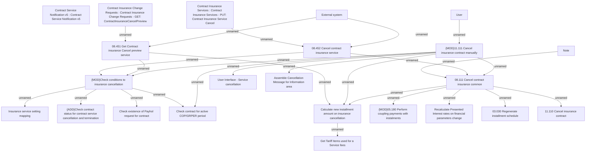

# Contract insurance cancellation

```mermaid
graph TD
    Contract_Service_Notification_v5_Contract_Service_Notificati["Contract Service Notification v5 : Contract Service Notification v5"]
    Insurance_service_setting_mapping["Insurance service setting mapping"]
    ADD_Check_contract_status_for_contract_service_cancellation_["{ADD}Check contract status for contract service cancellation and termination"]
    MOD_Check_conditions_to_insurance_cancellation["{MOD}Check conditions to insurance cancellation"]
    Check_existence_of_Payhol_request_for_contract["Check existence of Payhol request for contract"]
    Check_contract_for_active_COP_GRPER_period["Check contract for active COP/GRPER period"]
    el_1878984["Note"]
    Contract_Insurance_Services_Contract_Insurance_Services_PUT_["Contract Insurance Services : Contract Insurance Services - PUT: Contract Insurance Service Cancel"]
    External_system["External system"]
    n_08_111_Cancel_contract_insurance_common["08.111 Cancel contract insurance common"]
    Contract_Insurance_Change_Requests_Contract_Insurance_Change["Contract Insurance Change Requests : Contract Insurance Change Requests - GET: ContractInsuranceCancelPreview"]
    n_08_452_Cancel_contract_insurance_service["08.452 Cancel contract insurance service"]
    n_08_451_Get_Contract_insurance_Cancel_preview_service["08.451 Get Contract insurance Cancel preview service"]
    User_Interface_Service_cancellation["User Interface : Service cancellation"]
    Assemble_Cancellation_Message_for_Information_area["Assemble Cancellation Message for Information area"]
    Calculate_new_installment_amount_on_insurance_cancellation["Calculate new installment amount on insurance cancellation"]
    Get_Tariff_Items_used_for_a_Service_fees["Get Tariff Items used for a Service fees"]
    MOD_05_180_Perform_coupling_payments_with_instalments["{MOD}05.180 Perform coupling payments with instalments"]
    Recalculate_Presented_Interest_rates_on_financial_parameters["Recalculate Presented Interest rates on financial parameters change"]
    n_03_030_Regenerate_installment_schedule["03.030 Regenerate installment schedule"]
    MOD_11_111_Cancel_insurance_contract_manually["{MOD}11.111 Cancel insurance contract manually"]
    User["User"]
    n_11_110_Cancel_insurance_contract["11.110 Cancel insurance contract"]
    Contract_Insurance_Change_Requests_Contract_Insurance_Change -->|unnamed| n_08_451_Get_Contract_insurance_Cancel_preview_service
    MOD_Check_conditions_to_insurance_cancellation -->|unnamed| Insurance_service_setting_mapping
    MOD_Check_conditions_to_insurance_cancellation -->|unnamed| Check_existence_of_Payhol_request_for_contract
    MOD_Check_conditions_to_insurance_cancellation -->|unnamed| ADD_Check_contract_status_for_contract_service_cancellation_
    el_1878984 -->|unnamed| n_08_111_Cancel_contract_insurance_common
    Contract_Insurance_Services_Contract_Insurance_Services_PUT_ -->|unnamed| n_08_452_Cancel_contract_insurance_service
    n_08_111_Cancel_contract_insurance_common -->|unnamed| Recalculate_Presented_Interest_rates_on_financial_parameters
    n_08_111_Cancel_contract_insurance_common -->|unnamed| MOD_05_180_Perform_coupling_payments_with_instalments
    n_08_111_Cancel_contract_insurance_common -->|unnamed| n_03_030_Regenerate_installment_schedule
    MOD_Check_conditions_to_insurance_cancellation -->|unnamed| Check_contract_for_active_COP_GRPER_period
    n_08_111_Cancel_contract_insurance_common -->|unnamed| n_11_110_Cancel_insurance_contract
    n_08_452_Cancel_contract_insurance_service -->|unnamed| MOD_Check_conditions_to_insurance_cancellation
    n_08_452_Cancel_contract_insurance_service -->|unnamed| n_08_111_Cancel_contract_insurance_common
    n_08_451_Get_Contract_insurance_Cancel_preview_service -->|unnamed| MOD_Check_conditions_to_insurance_cancellation
    n_08_451_Get_Contract_insurance_Cancel_preview_service -->|unnamed| Calculate_new_installment_amount_on_insurance_cancellation
    Calculate_new_installment_amount_on_insurance_cancellation -->|unnamed| Get_Tariff_Items_used_for_a_Service_fees
    MOD_11_111_Cancel_insurance_contract_manually -->|unnamed| User_Interface_Service_cancellation
    MOD_11_111_Cancel_insurance_contract_manually -->|unnamed| Check_contract_for_active_COP_GRPER_period
    MOD_11_111_Cancel_insurance_contract_manually -->|unnamed| Assemble_Cancellation_Message_for_Information_area
    MOD_11_111_Cancel_insurance_contract_manually -->|unnamed| Calculate_new_installment_amount_on_insurance_cancellation
    MOD_11_111_Cancel_insurance_contract_manually -->|unnamed| MOD_Check_conditions_to_insurance_cancellation
    MOD_11_111_Cancel_insurance_contract_manually -->|unnamed| n_08_111_Cancel_contract_insurance_common
    n_08_111_Cancel_contract_insurance_common -->|unnamed| Calculate_new_installment_amount_on_insurance_cancellation
    User -->|unnamed| MOD_11_111_Cancel_insurance_contract_manually
    External_system -->|unnamed| n_08_452_Cancel_contract_insurance_service
    External_system -->|unnamed| n_08_451_Get_Contract_insurance_Cancel_preview_service
```
